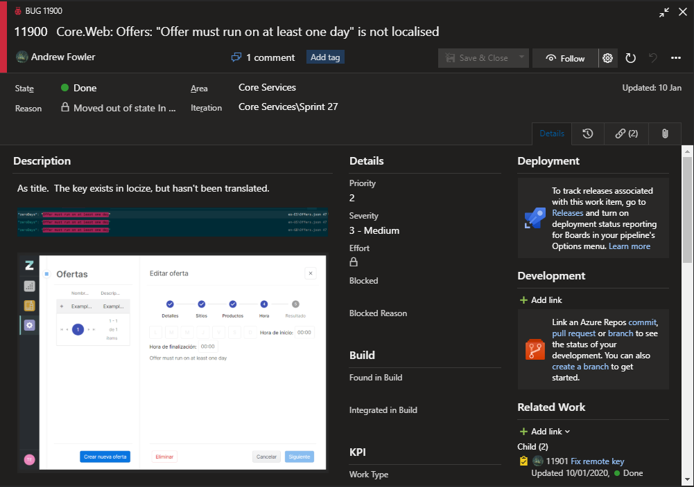

@snap[text-10 text-gold]
Locize Tester Demo
@snapend

@snap[south text-10 span-100]
Q&A
@snapend

---
@title[TITLE]
@snap[north text-uppercase text-10 text-gold span-100]
Why we made it
@snapend

+++
@title[Translation is hard]

- Making a mistake in translation is really easy
- Finding all mistakes in translation is really hard

+++
@title[Therefore bugs]
@snap[north text-uppercase text-10 text-gold span-100]
Therefore, bugs!
@snapend

---

@title[Broken keys]
@snap[north text-uppercase text-10 text-gold span-100]
Broken keys
@snapend

---

@title[Untranslated Keys]
@snap[north text-uppercase text-10 text-gold span-100]
Untranslated Keys
@snapend

---