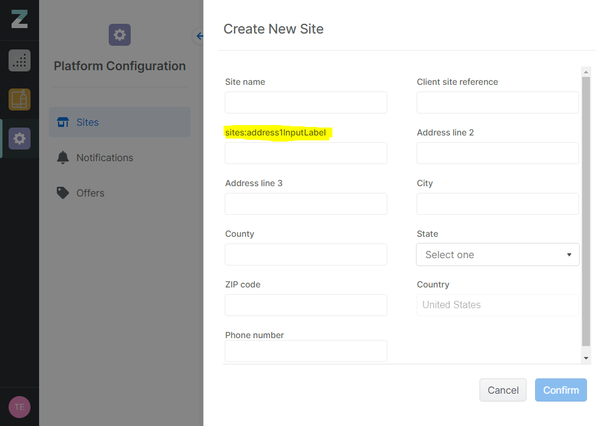
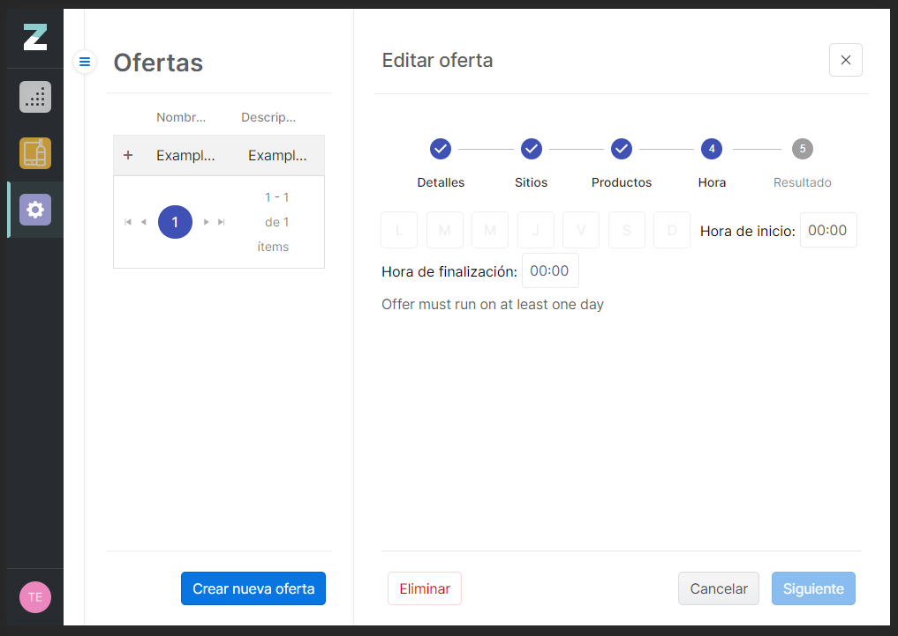

@snap[text-10 text-gold]
Locize Tester Demo
@snapend

@snap[south text-10 span-100]
Q&A
@snapend

---
@title[TITLE]
@snap[north text-uppercase text-10 text-gold span-100]
Why we made it
@snapend

@snap[west span-100 text-07]
@ul[spaced]
- Typoing a key name is easy
- Forgetting to add a translation is easy
- Finding translation issues through test automation is expensive
- Finding bugs/regressions manually in translations is expensive and error prone
@ulend
@snapend

Note:
- Example Note

---

@title[Broken keys]
@snap[north text-uppercase text-10 text-gold span-100]
Broken keys
@snapend

---

@title[Untranslated Keys]
@snap[north text-uppercase text-10 text-gold span-100]
Untranslated Keys
@snapend

---