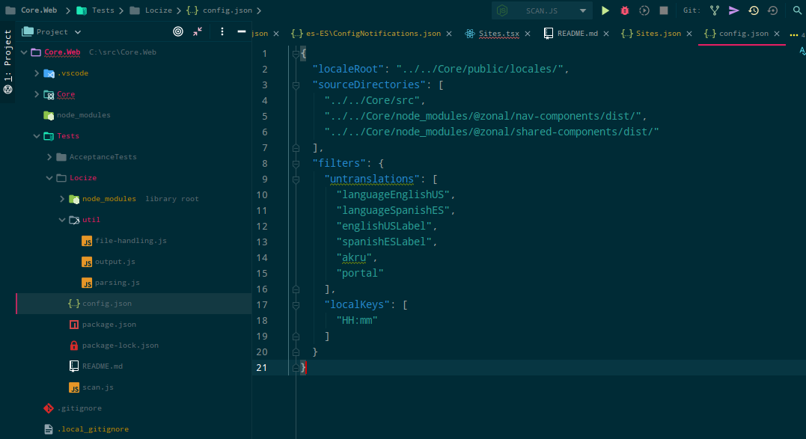

@snap[text-10 text-gold]
Locize Tester Demo
@snapend

@snap[south text-10 span-100]
Q&A
@snapend

---
@title[Why we made it]
@snap[north text-uppercase text-10 text-gold span-100]
Why we made it
@snapend

+++
@title[Translation is hard]
@snap[north text-uppercase text-10 text-gold span-100]
Translation is hard!
@snapend

- Making a mistake in translation is really easy
- Finding all mistakes in translation is really hard and expensive

+++
@title[Therefore bugs]

+++

@title[Untranslated Keys]

+++

@title[Broken keys]

---

@title[How it works]
@snap[north text-uppercase text-10 text-gold span-100]
How it works
@snapend

+++

@title[Loads translation files]
@snap[north text-uppercase text-10 text-gold span-100]
Loads translation files
@snapend

+++

@title[Parses the source]
@snap[north text-uppercase text-10 text-gold span-100]
Parses the source
@snapend

---

@title[How to use it]
@snap[north text-uppercase text-10 text-gold span-100]
How to use it
@snapend

+++

@title[Config]
@snap[north text-uppercase text-10 text-gold span-100]

@snapend

---
